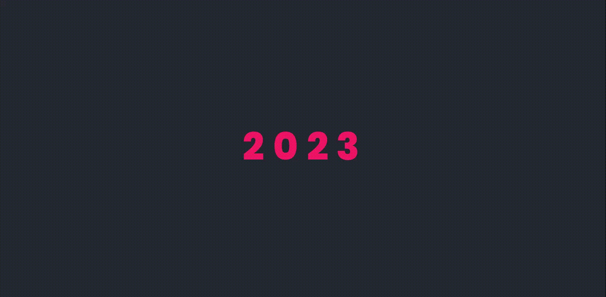

# Yeni Yıl Projesi - Görkemli Yazılım
## CSS kısmında pozisyon PX değerleri sizlerde farklı sonuçlar verebilir, eğer görüntü kötüyse kendi ekranınıza göre PX değerlerini ayarlayabilirsiniz. CSS animasyon kısmında tüm PX değerleri mevcut.

YouTube videosu için [buraya tıklayın](https://youtu.be/x6v1EgxJzYE)

İndirmek için:

```markdown
git clone https://github.com/gorkemliyazilim/new-year-project.git
```

<div style="display: flex; justify-content: space-between;">
  
</div>
